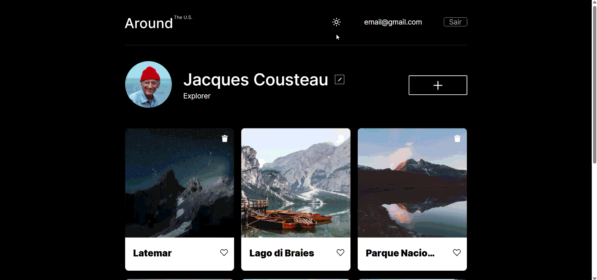
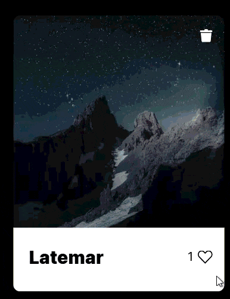
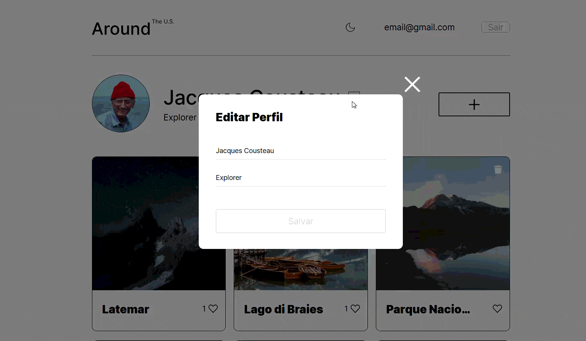
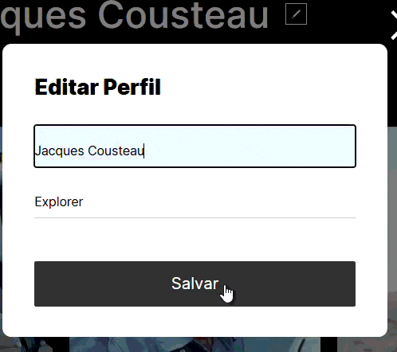
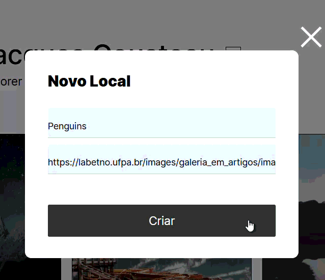
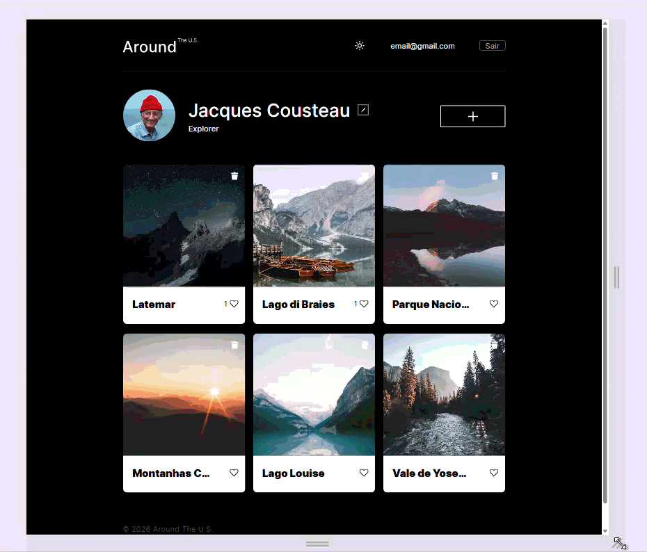
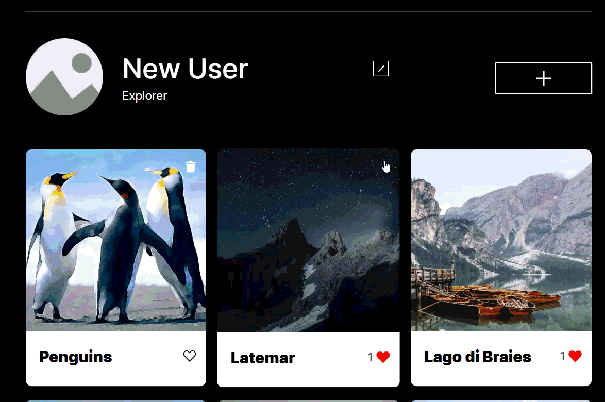

# Tripleten web_project_api_full

A full-stack web application inspired by the “Around the U.S.” project. This repository contains the complete implementation of a React frontend and a Node.js/Express REST API with authentication, protected routes, card management, profile editing, and secure secret handling.

## Live Demo

- Frontend: https://web-project-api-full-topaz.vercel.app/
- Backend API: https://web-project-api-full-t9w5.onrender.com/

## Overview

This app allows users to:

- Sign up and log in
- Create and delete cards
- Like and unlike cards
- Edit their profile and avatar
- Switch between dark and light themes
- Access protected routes only when authenticated

The project is split into two main parts:

- `frontend/` — React + Vite client application
- `backend/` — Express API + MongoDB + authentication logic

## Features

### Frontend

- Responsive single-page app built with React and Vite
- Protected routes for authenticated users only
- Login and registration flows
- User profile editing and avatar update
- Card creation with validation and feedback
- Like/unlike interactions with instant UI updates
- Modal-based forms and image lightbox
- Dark/light theme with persistence via `localStorage`
- Loading states and validation messages for a smoother UX

### Backend

- RESTful API built with Node.js and Express
- JWT-based authentication and protected route middleware
- MongoDB schema modeling for users and cards
- Input validation using `celebrate` and `Joi`
- Centralized error handling with consistent HTTP responses
- Structured request and error logging
- Secure environment variable loading with `dotenv`

## Tech Stack

### Frontend

- React 18
- Vite
- React Router
- CSS3
- LocalStorage-based theme persistence

### Backend

- Node.js
- Express.js
- MongoDB + Mongoose
- JWT (jsonwebtoken)
- Dotenv
- Crypto
- CORS

## Screenshots

### Theme switching



### Interactive cards and likes



### Modals and forms







### Responsive layout



### Delete confirmation flow



## Project Structure

```text
web_project_api_full
├─ backend
│  ├─ .editorconfig
│  ├─ .env
│  ├─ .eslintrc
│  ├─ .prettierrc
│  ├─ app.js
│  ├─ controllers
│  │  ├─ cards.js
│  │  └─ users.js
│  ├─ errors
│  │  ├─ BadRequestError.js
│  │  ├─ ConflictError.js
│  │  ├─ ForbiddenError.js
│  │  ├─ NotFoundError.js
│  │  └─ UnauthorizedError.js
│  ├─ middlewares
│  │  ├─ auth.js
│  │  └─ logger.js
│  ├─ models
│  │  ├─ card.js
│  │  └─ user.js
│  ├─ package-lock.json
│  ├─ package.json
│  ├─ request.log
│  ├─ error.log
│  └─ routes
│     ├─ cards.js
│     └─ users.js
├─ frontend
│  ├─ .env
│  ├─ dist
│  ├─ eslint.config.js
│  ├─ index.html
│  ├─ package-lock.json
│  ├─ package.json
│  ├─ public
│  │  ├─ favicon.svg
│  │  └─ icons.svg
│  ├─ src
│  │  ├─ assets
│  │  ├─ blocks
│  │  ├─ components
│  │  ├─ contexts
│  │  ├─ hooks
│  │  ├─ images
│  │  ├─ utils
│  │  ├─ vendor
│  │  ├─ index.css
│  │  ├─ main.jsx
│  │  └─ App.jsx
│  └─ vite.config.js
└─ README.md
```

## Prerequisites

Before running the app locally, make sure you have:

- Node.js 18+
- npm
- MongoDB running locally or a MongoDB connection string

## Environment Variables

Create `.env` files in the `backend` and `frontend` folders as needed.

### Backend `.env` example

```bash
PORT=3000
MONGO_URI=mongodb://127.0.0.1:27017/aroundtheus
JWT_SECRET=your_super_secret_key
NODE_ENV=development
```

### Frontend `.env` example

```bash
VITE_API_URL=http://localhost:3000
```

## Local Setup

### 1) Clone the repository

```bash
git clone https://github.com/kaioangelr-dot/web_project_api_full.git
cd web_project_api_full
```

### 2) Install backend dependencies

```bash
cd backend
npm install
```

### 3) Install frontend dependencies

```bash
cd ../frontend
npm install
```

### 4) Start MongoDB

Make sure MongoDB is running locally before starting the backend.

### 5) Run the backend

```bash
cd backend
npm run dev
```

### 6) Run the frontend

```bash
cd frontend
npm run dev
```

The frontend usually runs on `http://localhost:5173` and the backend on `http://localhost:3000`.

## API Endpoints

### Authentication

- `POST /signup` — register a new user
- `POST /signin` — log in and receive a JWT

### Users

- `GET /users/me` — get the current user profile
- `PATCH /users/me` — update profile information
- `PATCH /users/me/avatar` — update avatar image

### Cards

- `GET /cards` — get all cards
- `POST /cards` — create a new card
- `DELETE /cards/:cardId` — delete a card
- `PUT /cards/:cardId/likes` — like a card
- `DELETE /cards/:cardId/likes` — unlike a card

## Security Notes

- JWTs are used for authenticated API access.
- Protected routes validate the token before granting access.
- Sensitive environment variables are kept in `.env` files and excluded from Git.
- Secrets can be generated securely with Node.js crypto:

```bash
node -e "console.log(require('crypto').randomBytes(32).toString('hex'));"
```

## Request Validation and Error Handling

The backend validates input before controller logic runs, helping prevent malformed requests and invalid URLs or email addresses.

Common error responses include:

- `400 Bad Request`
- `401 Unauthorized`
- `403 Forbidden`
- `404 Not Found`
- `500 Internal Server Error`

## Security Checklist

- [x] Client-side token storage and protected routes implemented
- [x] JWT validation enforced on private routes
- [x] Strong secret generation using `crypto.randomBytes(32)`
- [x] Environment credentials excluded from source control

## Future Improvements

### Frontend

- [ ] Add personalized feed filtering and sorting
- [ ] Allow drag-and-drop card reordering on user profiles
- [ ] Add username, avatar, and description inputs to the registration flow
- [ ] Support drag-and-drop media uploads in card creation
- [ ] Add automated frontend testing

### Backend and Security

- [ ] Move JWT storage from `localStorage` to `httpOnly` cookies
- [ ] Add rate limiting for `/signin` and `/signup`
- [ ] Integrate cloud storage like Amazon S3 or Cloudinary for image uploads
- [ ] Expand automated testing with Jest and Supertest

## Notes

This project demonstrates a complete full-stack architecture using a modern React frontend and a secure Express backend. It is suitable for learning about full-stack web development, REST APIs, JWT authentication, and MongoDB-driven applications.

## Server Domain

- API: https://web-project-api-full-t9w5.onrender.com/
- Frontend: https://web-project-api-full-topaz.vercel.app/
